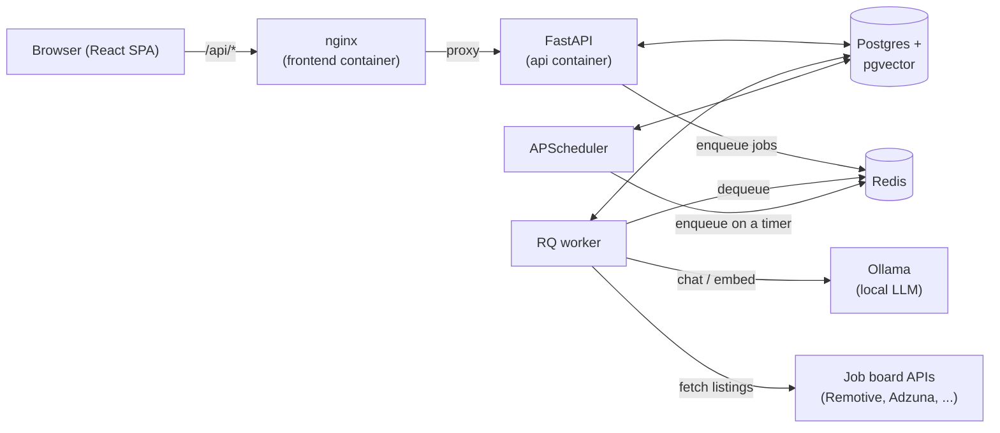
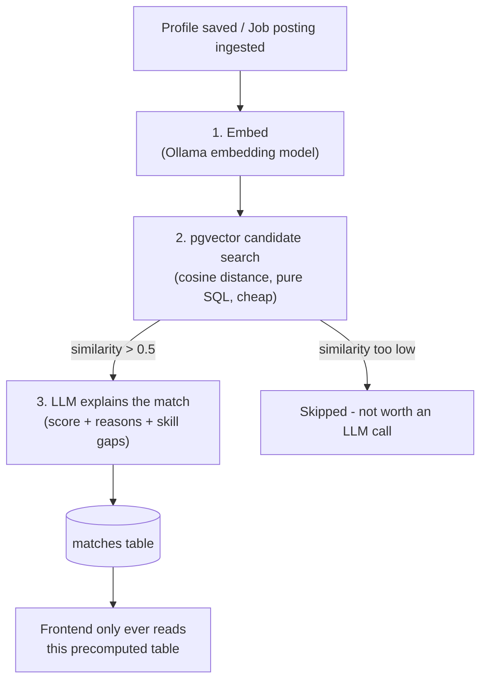

# App Flow & Features

This document explains **what the app does and how it works end-to-end** —
for a file-by-file code reference, see [CODE_DOCUMENTATION.md](CODE_DOCUMENTATION.md)
instead. Read this one first; it gives you the mental model, and the code
doc fills in "which file does that."

## 1. What this is

A self-hosted job search assistant. You give it your profile (by uploading
a CV or filling in a form), and it: pulls in jobs from several job boards,
ranks them against your profile with AI, helps you draft tailored
applications, tracks where each one stands, shows salary data, and answers
questions through a chat assistant — all running on your own server against
a local LLM (via [Ollama](https://ollama.com)), so nothing about your job
search is sent to a third party.

## 2. The shape of the system



Five long-running processes, one Postgres database, one Redis instance:

| Process | Container | What it does |
|---|---|---|
| **API** | `api` | Handles every HTTP request from the browser. Never talks to Ollama or external job APIs directly for anything slow — it reads/writes Postgres and hands slow work off to Redis. |
| **Worker** | `worker` | Pulls jobs off two Redis queues (`default`, `llm`) and does the actual slow work: calling Ollama, calling job-board APIs, generating PDFs' source data. |
| **Scheduler** | `scheduler` | The only process with a clock. Every few minutes it checks "which job sources are due to be polled?" and "is it time for the nightly salary refresh?", and enqueues work for the worker to pick up. Must only ever run as one instance. |
| **Postgres** | `postgres` | All persistent data, including embedding vectors (via the pgvector extension). |
| **Redis** | `redis` | Just the job queue (RQ). Nothing is read from Redis directly by the frontend. |
| **Ollama** | `ollama` | The local LLM server. Only the worker process talks to it. |

**Why split API and worker like this:** an HTTP request should come back
in milliseconds. Anything that takes seconds (an LLM call) or could fail
(a third-party API) has no business running inside a request. So the API's
job is almost always "write a row, enqueue a task, return immediately" —
and the *actual* work (parsing a CV, embedding text, explaining a match,
drafting a cover letter) happens in the worker, with the frontend polling
or re-fetching to see the result land.

## 3. The two decisions that shape everything

These came out of an explicit conversation before anything was built, and
almost every design choice below traces back to one of them:

1. **Auto-apply is review-then-submit, always.** The AI drafts a tailored
   resume, cover letter, and answers — a human always clicks "submit" on
   the real job site. Nothing in this codebase logs into LinkedIn/Indeed
   with stored credentials and submits on your behalf. That kind of
   automation is what gets accounts permanently banned, and it's a ToS
   violation on every major platform.
2. **Job sources are public/official APIs, plus links you add yourself** —
   not scraping of logged-in platforms. See §5 below for the full list.

## 4. Feature walkthroughs

### 4.1 Auth & first run

- The very first `POST /auth/register` call creates the one "owner"
  account. After that, `auth_service.register_owner` sees the `users`
  table is non-empty and refuses every subsequent call with a 403 — there
  is no ongoing multi-user signup surface, by design (this is a personal
  tool, not a SaaS).
- Login returns one JWT (7 days by default), stored in the browser via
  Zustand + localStorage (`frontend/src/store/authStore.ts`). Every API
  call attaches it as `Authorization: Bearer <token>` via an axios
  interceptor (`frontend/src/api/client.ts`). A 401 anywhere clears the
  token and bounces you to `/login`.

### 4.2 Profile & CV

Two ways to fill in your profile, both landing in the same place:

- **Manual**: the CV builder form (`frontend/src/features/profile/`) — one
  section per part of a resume (experience, education, skills, projects,
  certifications, languages). Saving calls `PUT /api/profile`, which does
  a full replace of your profile's child rows from what you submitted
  (`services/profile_service.replace_profile`) — simplest correct
  behavior for a "the whole form is the source of truth" UI.
- **Upload**: drop a PDF/DOCX/TXT on the same page. The flow:

  1. `POST /api/cv/upload` saves the file and creates a `cv_documents` row
     with `parse_status="pending"`, then enqueues `parse_cv_document`.
  2. The worker extracts plain text (`utils/text_extract.py`), sends it to
     Ollama with a JSON-schema-constrained prompt
     (`services/cv_parser_service.py`), and saves the structured result to
     `parsed_json`.
  3. The frontend polls `GET /api/cv/documents/{id}` every 1.5s while
     `parse_status` is `pending`/`processing`.
  4. Once `parsed`, you get a **"Use this data" button** — clicking it
     pre-fills the same form you'd fill in manually. **Nothing is written
     to your real profile until you review it and hit Save.** The AI's
     output is a starting point, never the final answer.

Either way, saving triggers step 1 of the matching pipeline (§4.4) in the
background, and you can download a formatted PDF any time
(`GET /api/cv/export?template=modern|classic`, rendered by WeasyPrint from
one of two Jinja2/CSS templates in `backend/app/templates/cv/`).

### 4.3 Job ingestion

- `job_sources` rows describe *where* to pull jobs from. A handful are
  seeded automatically on first boot (`main.py::_seed_default_job_sources`,
  using the list in `services/job_ingestion_service.DEFAULT_SOURCES`) so
  there's real data flowing without any setup. You can add more from
  Settings: any company's Greenhouse/Lever board (their career page's own
  public JSON API), or a regional job board's RSS/Atom feed.
- Every `SCHEDULER_SWEEP_INTERVAL_MINUTES` (default 5), the scheduler asks
  "which active sources are past their own `poll_interval_minutes`?" and
  enqueues `poll_source` for each one that's due. This is one clock
  driving many independently-timed sources, rather than one scheduled job
  per source.
- `poll_source` picks the right adapter (`integrations/job_sources/*.py`,
  one file per source type, all implementing the same `fetch(config)`
  interface) and upserts results into `job_postings`, keyed on
  `(source_id, external_id)`. A SHA-256 hash of the posting's content
  decides whether an existing row actually changed (so re-polling doesn't
  spam re-embedding of unchanged postings). New/changed postings get
  queued for embedding (§4.4).
- **One source failing never breaks the sweep** — every adapter call is
  wrapped in a try/except that logs and records the error on the source
  row (`last_poll_status`, `last_poll_error`), visible in Settings.

### 4.4 Smart Match

This is the part worth understanding in some depth, because its whole
design is about **never calling the LLM synchronously on a page load**.
Three stages:



1. **Embed** (`workers/embedding_tasks.py`): whenever a profile is saved or
   a job posting is new/changed, its text gets turned into a vector via
   Ollama's embedding model and stored on the row itself
   (`profiles.embedding` / `job_postings.embedding`, both
   `vector(768)` columns).
2. **Candidate search** (`services/matching_service.py`,
   `find_candidate_jobs_for_profile` / `find_candidate_profiles_for_job`):
   a plain SQL query using pgvector's cosine-distance operator, backed by
   an HNSW index. Cheap enough to run on every single embedding change.
3. **LLM explanation** (`explain_match`): only for candidates whose
   similarity clears `SIMILARITY_FLOOR` (0.5) does an LLM call happen, to
   produce a 0–100 fit score, a plain-language explanation, and
   matched/missing skills — written into the `matches` table.

The frontend (`GET /api/matches`) **only ever reads that table**. The one
exception is a manual "Refresh my matches" button, which just re-enqueues
step 1 for your profile — still asynchronous, still never blocks a
request.

### 4.5 Applications (the "Auto-Apply" feature)

From a job's detail page, "Start application draft":

1. `POST /api/applications` creates an `applications` row
   (`status="saved"`, `draft_status="none"`) and enqueues
   `generate_application_draft`.
2. The worker (`services/application_service.py`) sends your real profile
   + the job description to Ollama with instructions to never invent
   experience you don't have, and gets back: a tailored professional
   summary, which of your *existing* skills to emphasize, a cover letter,
   and draft answers to a few common application questions.
3. That becomes a `cv_documents` row (`kind="generated"`) holding just the
   *tailoring instructions* (summary + emphasized skills) — not a
   rendered PDF. The tailored PDF itself is rendered on demand
   (`GET /api/applications/{id}/resume.pdf`) by replaying those
   instructions over your real experience/education
   (`cv_export_service.render_tailored_pdf`), so it's always in sync with
   your latest profile data.
4. You land on a **review screen**: edit the cover letter and answers,
   download the tailored resume, then go apply on the real site yourself.
   Only once you have does clicking "Applied" make sense — that's a
   manual `PATCH /api/applications/{id}/status` call, logged as an
   `application_events` row for the history timeline.
5. The **kanban board** (`pages/Applications.tsx`) is just a view over
   `applications.status`; dragging a card between columns is the same
   status-update call.

### 4.6 Market Insights (salary data)

Three possible sources per (role, location) query, always degrading
gracefully:

- **`aggregated_postings`** — percentiles computed directly from the
  salary fields on job postings you've already ingested. Always available,
  no external dependency.
- **`adzuna`** — a live estimate from Adzuna's search API, if you've set
  `ADZUNA_APP_ID`/`ADZUNA_APP_KEY`.
- **`bls`** — opt-in only; see the note in
  `integrations/salary_apis/bls.py` about why this ships empty.

A nightly job (`workers/salary_tasks.py`) precomputes snapshots for a
curated list of common tech roles/locations so the Market page loads
instantly for the common case. Typing in an uncommon role still works —
`services/salary_service.get_salary_insights` computes an aggregated
figure live if nothing fresh is cached.

### 4.7 Copilot chat

A chat interface grounded in your data: every message sent includes a
system prompt built from your profile text, and — if the chat session was
opened from a specific job — that job's description too
(`services/chat_service._build_system_prompt`). Responses stream token by
token from Ollama straight through the FastAPI response
(`routers/chat.py`'s `StreamingResponse`) to the browser
(`api/client.ts`'s `streamChatMessage`, using `fetch` + `ReadableStream`
since axios doesn't stream well in a browser).

### 4.8 Settings

- **Job sources**: add/pause/delete sources, or trigger an immediate poll
  ("Poll now") instead of waiting for the schedule.
- **Server configuration**: a read-only view of what's active (which
  models, which optional API keys are configured) — see
  `routers/settings.py`'s docstring for why this isn't live-editable yet.

## 5. Job sources, concretely

| Source | Needs a key? | What it covers |
|---|---|---|
| Remotive, RemoteOK, Arbeitnow, The Muse | No | General/remote tech jobs, free public APIs |
| Adzuna | Yes (free tier) | Broad job search + salary estimates |
| USAJobs | Yes (free) | US federal government positions |
| Greenhouse / Lever | No (you supply a company slug) | Any specific company's own career page - these are the same public JSON endpoints their career page widgets use |
| Custom RSS/Atom | No (you supply a feed URL) | Any regional/niche board that publishes a feed |

## 6. Data model, at a glance

```
users ──1:1── profiles ──1:N── work_experience / education / certifications
                │                / projects / languages / skills / cv_documents
                │
                └─1:N── matches ──N:1── job_postings ──N:1── job_sources
                                              │
users ──1:N── applications ──N:1────────────┘
   │              │
   │              └─1:N── application_events
   │
   ├─1:N── chat_sessions ──1:N── chat_messages
   └─1:N── job_sources (user-added ones; built-in sources have user_id = NULL)

salary_snapshots  - standalone, keyed by (role_title, location, source)
app_settings      - standalone key/value table
```

Full column-level detail is easiest to read straight from the models
(`backend/app/models/*.py`) or the initial migration
(`backend/alembic/versions/0001_initial.py`), which is the authoritative
schema.

## 7. A concrete example: "I upload my resume"

Tracing one action all the way through, to make the pattern above concrete:

1. **Browser**: `CVUpload.tsx` sends the file via `useUploadCV()` →
   `POST /api/cv/upload`.
2. **API** (`routers/cv.py`): saves the file to the shared `uploads`
   volume, inserts a `cv_documents` row, calls
   `default_queue().enqueue("app.workers.cv_tasks.parse_cv_document", id)`,
   returns the row immediately (`parse_status="pending"`).
3. **Browser**: now polling `GET /api/cv/documents/{id}` every 1.5s
   (`useCVDocument`'s `refetchInterval`).
4. **Worker** (`workers/cv_tasks.py`): picks up the job, extracts text
   (`utils/text_extract.py`), calls Ollama for structured extraction
   (`services/cv_parser_service.py`), writes `parsed_json` and
   `parse_status="parsed"`.
5. **Browser**: next poll sees `parsed_status="parsed"`, stops polling,
   shows the "Use this data" button.
6. **User** reviews/edits the pre-filled form, clicks Save →
   `PUT /api/profile`.
7. **API** (`services/profile_service.py`): replaces the profile's rows,
   enqueues `generate_profile_embedding` on the `llm` queue.
8. **Worker** (`workers/embedding_tasks.py` → `matching_tasks.py`):
   embeds the new profile text, runs the pgvector candidate search against
   all job postings, and for the promising ones, calls Ollama again to
   produce match explanations — landing in the `matches` table.
9. **Browser**: next visit to the Jobs page shows the updated matches,
   read straight from that table — no LLM call happens at that moment.
